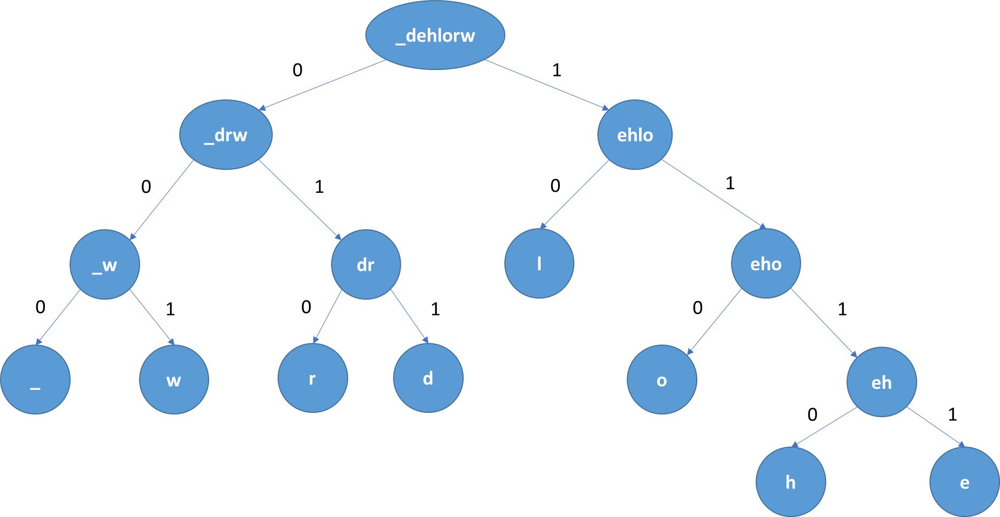

# Tree Algorithms Compression Correction Huffman and Hamming
# Algoritmos de Árboles: Compresión y Corrección usando Huffman y Hamming

## Universidad Autónoma de Yucatán

### Maestría en Ciencias de la Computación

Matemáticas Discretas Proyecto Final

### Autores

* Dayan Bravo
* Mario Herrera

## Descripción general del sistema

### Objetivo

El objetivo de este sistema es leer archivos de texto y conviertir su contenido en un archivo binario comprimido utilizando el método de Huffman.
Luego tomar este archivo binario y codificarlo utilizando el método de Hamming lo que permite transmitir la información de un lugar a otro y corregir aquellos errores que puedan surgir por el camino. 
Para introducir errores en el archivo binario creado por el algoritmo de Hamming se utiliza una función que aleatoriamente modifica un bit en algunos conjuntos de 8 bits. 
De esta forma se puede probar que el algoritmo funciona correctamente.
El proceso paso a paso sería como se describe a continuación:

1. Leer un archivo de texto.
2. Construir una tabla de frecuencias para los caracteres existentes en el texto leído.
3. Construir un árbol binario que permita convertir cadenas binarias en caracteres.
4. Generar cadenas binarias de 8 bits que representen el contenido del texto leído.
5. Codificar estas cadenas en grupos de 4 bits de información y añadiendo 3 bits de pariedad.
6. Añadir errores aleatorios al archivo binario que contiene el texto codificado.
7. Enviar el archivo con errores de una lugar a otro.
8. Recibir el archivo con errores.
9. Corregir los errores existentes archivando la ubicación en que se encontró cada error.
10. Decodificar el archivo para obtener nuevamente su forma comprimida.
11. Descomprimir el archivo para obtener el texto original.

### Documentación Técnica

#### Clase Tree ####

La clase Tree contiene la estructura básica de un árbol binario, el cual tiene su propio _data_ que permite almacenar
información en el nodo, contiene además un nodo izquierdo y un nodo derecho que representan a los hijos izquierdo y 
derecho del nodo respectivamenten.

#### Clase TreeObject ####

La clase TreeObject representa la _data_ dentro de un nodo Tree.

#### Clase FileManager ####

La clase FileManager gestiona todas las funcionalidades relacionadas con leer o escribir ficheros. Los métodos que 
contiene son los siguientes:

* **write_txt:** Permite almacenar en un archivo el texto deseado.
* **read_txt:** Permite leer un archivo de texto y almacenarlo en una variable para ser procesado posteriormente.
* **write_bin:** Genera un archivo binario a partir del código en forma de texto.
* **read_bin:** Lee un archivo binario y lo traduce a texto.

#### Clase FrequencyCalculator ####

La clase FrequencyCalculator contiene los métodos que permiten gestionar la frecuencia con que aparecen cada uno de
los caracteres en el archivo de texto que sirve como entrada para todo el proceso que realiza este sistema. Los métodos 
que contiene son los siguientes:

* **count_symbols:** Permite contar la cantidad de veces que aparece cada símbolo en el archivo de texto leído.
* **frequency_symbols:** Crea un diccionario que contiene cada caracter perteneciente al archivo leído con su frecuencia asociada.
* **export_json_frequency:** Exporta el diccionario que contiene los caracteres con su frecuencia a un archivo de tipo json.
* **import_json_frequency:** Importa el diccionario que contiene los caracteres con su frecuencia desde un archivo de tipo json.

#### Clase SymbolMapper ####

Esta es una clase auxiliar para gestionar algunos símbolos utilizados en los archivos json.

#### Clase Code ####

Esta clase gestiona todo lo  relacionado con las operaciones que se pueden realizar sobre un código o fregmento de 
código. Los métodos que contiene son:

* **extract:** Extrae una cantidad determinada de bits menos significativos de un código.
* **concat_zero:** Concatena un cero a la derecha de un número binario.
* **concat_one:** Concatena un uno a la derecha de un número binario.
* **concat_zero_init:** Concatena un cero a la izquierda de un número binario.
* **concat_one_init:** Concatena un uno a la izquierda de un número binario.
* **concat_init:** Concatena un número binario a la izquierda de otro número binario.
* **complete_byte:** Añade bits hasta alcanzar una longitud de 8 bits en una cadena cuando no hay suficientes bits para completarla con bits de información.
* **get_code_from_string:** Permite obtener el código de un texto.

#### Clase Huffman ####

Esta es la clase principal para la parte de convertir un archivo de texto a un archivo binario comprimido. Los métodos 
que contiene son los siguientes: 

* **generate_tree:** Genera el árbol que permite convertir un símbolo de texto a una cadena de ceros y unos o viceversa. 
* **generate_code:** Genera el diccionario que contiene todas las representaciones en binario de los caracteres extraídos del texto.
* **__generate_code_recursive:** Este método recorre el árbol generado por _generate_tree_ de manera recursiva sirviendo como apoyo al método _generate_code_.
* **encode:** Convierte una cadena de símbolos en formato de texto a una cadena en formato binario.
* **decode:** Convierte una cadena en formato binario a una cadena de símbolos en formato de texto.
* **export_json_codes:** Exporta el diccionario que contiene la representación de cada símbolo en formato binario a un archivo de tipo json.
* **export_json_tree:** Exporta el árbol a un archivo de tipo json.
* **__export_json_tree_recursive:** Método auxiliar que apoya al método _export_json_tree_ para exportar el árbol a un archivo de tipo json.

#### Clase BinaryMatrix ####

La clase BinaryMatrix es la encargada de gestionar todos los métodos necesarios para manejar las matrices utilizadas 
en el método de Hamming para codificar una cadena de datos bianrios y detectar y corregir un error. Los métodos que 
posee son los siguientes:

* **concatenate:** Concatena dos matrices siempre que se puedan concatenar debido a sus dimensiones.
* **transpose:** Devuelve la matriz traspuesta de una matriz que recibe por parámetros.
* **identity:** Genera una matriz identidad del tamaño proporcionado por parámetros.
* **gen_matrix_from_code:** Transforma un código en formato binario a una matriz fila o columna según se requiera.

#### Clase Hamming ####

La clase Hamming es la encargada de gestionar todos los métodos referentes a la parte de codificar la cadena binaria
comprimida por Huffman y luego decodificarla. En esta clase también se utiliza el algoritmo que le añade errores de 
forma aleatoria a la cadena. Los métodos que contiene esta clase son los siguientes:

* **encode:** Método que prepara las condiciones para la poder codificar una cadena utilizando encode_one.
* **encode_one:** Método encargado de multiplicar la matriz de Hamming (G) por la matriz que representa al fragmento de código.
* **decode:** Método que prepara las condiciones para la poder decodificar una cadena utilizando dencode_one.
* **decode_one:** Método encargado de decodificar un fragmento de código codificado anteriormente con Hamming y tambien de identificar y localizar si hay un bit con error.
* **__set_k:** Establece el valor de k.
* **__set_n:** Establece el valor de n.
* **__gen_g:** Genera la matriz G que tiene la primera parte que es una matriz identidad y luego otra parte que es la matriz A.
* **__gen_a:** Genera la matriz A que se utiliza para completar la matriz G cumpliendo con las condiciones de que no haya dos columnas iguales y que no haya ninguna columna con todos sus valores en cero.
* **__gen_at:** Calcula la matriz traspuesta de A.
* **__gen_h:** Genera la matriz H que es la matriz de comprobación de pariedad necesaria para deectar errores en los bits.

### Un ejemplo sencillo

Suponiendo un texto de entrada pequeño se pretende recrear cómo se debe ir comportando el algoritmo paso paso, ilustrando 
desde que se lee el fichero de texto, luego por todos los procesos que pasa hasta que finalmente se recupera el mismo 
texto al final del proceso.

Primero se lee un fichero de texto para tomar su contenido como base de todo el proceso, para este ejemplo se toma la 
frase siguiente:

**"Hello World"**

Este texto se toma y se analiza para obtner la frecuencia con que aparece cada caracter y se obtiene la información 
siguiente:

```python
{
	"l": 0.272727,
	"o": 0.181818,
	"h": 0.090909,
	"e": 0.090909,
	" ": 0.090909,
	"w": 0.090909,
	"r": 0.090909,
	"d": 0.090909
}
```

Utilizando estas frecuencias se construye el árbol que permite codificar cada caracter en una cadena de números binarios 
y viceversa. Para efectos del ejemplo el caracter que es un espacio en blanco se representó con un guión bajo. El árbol 
quedaría de la siguiente manera:



En un archivo json se vería de la siguiente manera:

```python
{
	"n": " dehlorw",
	"v": 1.0,
	"0": {
		"n": " drw",
		"v": 0.36363636363636365,
		"0": {
			"n": " w",
			"v": 0.18181818181818182,
			"0": {
				"n": " ",
				"v": 0.09090909090909091
			},
			"1": {
				"n": "w",
				"v": 0.09090909090909091
			}
		},
		"1": {
			"n": "dr",
			"v": 0.18181818181818182,
			"0": {
				"n": "r",
				"v": 0.09090909090909091
			},
			"1": {
				"n": "d",
				"v": 0.09090909090909091
			}
		}
	},
	"1": {
		"n": "ehlo",
		"v": 0.6363636363636364,
		"0": {
			"n": "l",
			"v": 0.2727272727272727
		},
		"1": {
			"n": "eho",
			"v": 0.36363636363636365,
			"0": {
				"n": "o",
				"v": 0.18181818181818182
			},
			"1": {
				"n": "eh",
				"v": 0.18181818181818182,
				"0": {
					"n": "h",
					"v": 0.09090909090909091
				},
				"1": {
					"n": "e",
					"v": 0.09090909090909091
				}
			}
		}
	}
}
```

Utilizando este árbol se pueden definir las representaciones en binario de cada uno de los caracteres de la siguiente
manera:

```python
{
	" ": "000",
	"w": "100",
	"r": "010",
	"d": "110",
	"l": "01",
	"o": "011",
	"h": "0111",
	"e": "1111"
}
```

Con estas representaciones en binario de cada uno de los caracteres se puede entonces traducir el texto "hello world" 
en la sigiuente serie de ceros y unos: 

```python
{
	"hello world": "11001010011100000011010111110111",
}
```

De esta forma queda comprimido el archivo de texto a una forma binaria lista para ser codificada por el algoritmo de 
Hamming. Para poder comenzar con Hamming es necesario dividir esta cadena en pequeñas cadenas de 4 bits, y si la cadena 
final queda incompleta entonces la completamos con ceros a la izquierda. Quedando de la siguiente manera:

```python
{
	"0": "1100",
	"1": "1010",
	"2": "0111",
	"3": "0000",
	"4": "0011",
	"5": "0101",
	"6": "1111",
	"7": "0111"
}
```

Luego se crea la matriz G que permite codificar estas cadenas de cuatro caracteres añadiendo algunos bits de pariedad
al final.

```python
"""G:[
	[1 0 0 0 0 1 1 1]
	[0 1 0 0 1 0 1 1]
	[0 0 1 0 1 1 0 1]
	[0 0 0 1 1 1 1 0]
]"""
```

Multiplicando cada una de las cadenas de longitud cuatro mostradas anteriormento por esta matriz G se obtienen los 
las cadenas binarias ya codificadas donde los primeros cuatro bits son los bitas d einformacion y los otros cuatro
son los bitas de pariedad añadidos por el algoritmo de Hamming, quedando de la siguiente manera:

```python
{
	"0": "11001100",
	"1": "10101010",
	"2": "01111000",
	"3": "00000000",
	"4": "00110011",
	"5": "01010101",
	"6": "11111111",
	"7": "01111000"
}
```

Estas cadenas están listas para ser enviadas por el emisor hacia el receptor, pero debido a interferencias que pueden 
haber en la señal algunos bits de estas cadenas pueden llegar de manera errónea. Un ejemplo de cómo puede verse uno de
estos errores sería modificar el primer bit de la derecha de la primera cadena, se vería de la siguiente manera:

```python
{
	"0-original": "11001100",
	"0-con-error": "10101011",
	
}
```

Luego el receptor al recibir este mensaje le llegaría de la siguiente manera:

```python
{
	"0": "11001101",
	"1": "10101010",
	"2": "01111000",
	"3": "00000000",
	"4": "00110011",
	"5": "01010101",
	"6": "11111111",
	"7": "01111000"
}
```

Entonces el receptor es el encargado de detectar dónde se encuentra el error y corregirlo, para ello utiliza la matriz 
siguiente:

```python
"""H:[
	[0 1 1 1 1 0 0 0]
	[1 0 1 1 0 1 0 0]
	[1 1 0 1 0 0 1 0]
	[1 1 1 0 0 0 0 1]
]"""
```

Multiplicando cada uno de los codigos de longitud de 8 bits recibidos por la matriz H es obtendrá como resultado una
nueva matriz fila que de estár completamente en cero indicará que ese código no tiene errores, mintras que si es algo 
diferente al cero entonces indicará la posicion del bit que tienen el error. La matriz obtenida en el caso de la primera
cadena que es la que tiene el error sería la siguiente:

```python
"""E:[
	[0 0 0 1]
]"""
```

Que si la observamos en forma de columa se vería de la siguiente forma:

```python
"""E:[
	[0]
	[0]
	[0]
	[1]
]"""
```

Y de esta forma es sencillo buscar cuál columna de la matriz H conside exactamente con esa secuencia de bits. Se vería 
de la siguiente manera:


```python
"""[
        [0 1 1 1 1 0 0 0]
	[1 0 1 1 0 1 0 0]
	[1 1 0 1 0 0 1 0]
	[1 1 1 0 0 0 0 1]
	
	                [0]
	                [0]
	                [0]
	                [1]
	La última columna de la matriz is idéntica a la matriz columna obtenida al multiplicar el código por H
]"""
```

De esa forma se puede observar que la posición que está indicando es la posición cero que es precisamente donde se 
introdujo el error en este ejemplo. Luego es sencillo ubicar este bit en la cadena que se está analizando y cambiar el 
bit que se encuentre en esa posición, quedando de la siguiente manera:

```python
{
	"0-con-error": "11001101",
	"0-corregido": "10101010",
	
}
```

Al realizar este proceso para el resto de las cadenas como en este ejemplo solo se introdujo un error en la primera las 
demás devolverán una cadena de ceros indicando que no tienen ningún error. Ya con los errores corregidos entonces se 
puede proceder a decodificar las cadenas de bits para ello basta con remover los últimos cuatro bits de la derecha, que 
son los bits de pariedad introducidos por Hamming, quedando el código nuevamente como estaba al comprimirlo con Huufman.
Quedaría de la siguiente manera:

```python
{
	"0": "1100",
	"1": "1010",
	"2": "0111",
	"3": "0000",
	"4": "0011",
	"5": "0101",
	"6": "1111",
	"7": "0111"
}
```

Luego se hace el proceso inverso de Huffman donde se va recorrriendo el árbol desde la raíz hacia las hojas a medida que
se van leyendo los valores bianrios de las cadenas ya decodificadas. Vale destacar que el receptor y el emisor deben 
tener las mismas tablas de frecuencias para poder trabajar con el mismo árbol sino esto no funcionaría. Finalmente se 
obtendría nuevamente el texto original, quedando d ela siguiente manera:

**"Hello World"**

De esa forma estaría completo todo el procedimiento y el algoritmo terminaría.